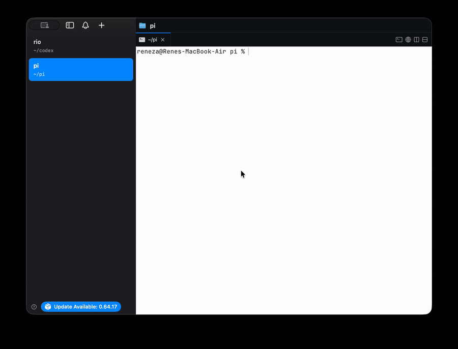

# pi-safe

`pi-safe` is a macOS sandbox launcher for the [Pi coding agent](https://pi.dev/).
It runs Pi inside a copied staging workspace with a macOS Seatbelt profile so the
real project stays read-only while the agent works.



## Default `pi` Override On macOS

When `bin/pi` is installed over the shell's default `pi` command, every normal
`pi` launch starts through `pi-safe` first. The wrapper finds the real Pi CLI,
creates a copied staging workspace, and runs Pi there under `/usr/bin/sandbox-exec`.
The agent can write staging, but direct writes to the real project are blocked
until you review and apply them with `pi-safe`.

Use `pi /sandbox` before launch to verify the wrapper, and `/sandbox` inside Pi
to verify the active sandbox session.

This is harness-level protection: the model can ask to run tools, but the
operating system blocks writes outside the staging/session directories.

## What It Does

- Copies the real project into per-session `original` and `staging` trees.
- Runs `pi` from `staging` under `sandbox-exec`.
- Denies file writes globally, then allows writes only to staging and session
  state.
- Uses a fake `HOME`, fake temp directory, and per-session Pi config/session
  directories.
- Shows staged diffs before applying.
- Applies changes only after explicit `--yes`.
- Takes a snapshot before applying.
- Uses `trash` for staged deletions when applying to the real project.
- Blocks symlink apply hazards by default.

## Install

Clone the repo and put `bin/pi-safe` on your `PATH`:

```bash
git clone https://github.com/renezander030/pi-safe.git
cd pi-safe
install -m 755 bin/pi-safe ~/.local/bin/pi-safe
```

Transparent default mode: install the `pi` wrapper as the command your shell
finds first. Then normal `pi ...` invocations run through `pi-safe`.

```bash
install -m 755 bin/pi ~/.local/bin/pi
# ensure ~/.local/bin appears before /opt/homebrew/bin in PATH
```

To overwrite the Homebrew `pi` command directly on macOS while preserving the
upstream entrypoint:

```bash
install -m 755 bin/pi-safe /opt/homebrew/bin/pi-safe
mv /opt/homebrew/bin/pi /opt/homebrew/bin/pi.homebrew-link
install -m 755 bin/pi /opt/homebrew/bin/pi
```

The wrapper first uses known Homebrew/npm Pi CLI paths, then discovers the next
real `pi` binary on `PATH` and passes it to `pi-safe --pi`, avoiding recursion.
Set `PI_SAFE_REAL_PI=/path/to/pi` if you want to pin the real binary, or
`PI_SAFE_BYPASS=1` when you intentionally need to run Pi without the sandbox,
for example:

```bash
PI_SAFE_BYPASS=1 pi --help
```

Check whether the wrapper is active before launching Pi:

```bash
pi /sandbox
```

Requirements:

- macOS with `/usr/bin/sandbox-exec`
- Python 3.9+
- `pi` on `PATH`
- `trash` recommended for applying deletions safely

## Use

Start a sandboxed Pi session:

```bash
pi-safe
```

By default, bare `pi-safe` starts Pi for the current directory. If you installed
the optional wrapper, bare `pi` does the same thing. You can pass a prompt
directly:

```bash
pi-safe "review this code"
# or, with the wrapper installed:
pi "review this code"
```

Start `pi` from the repo or workspace you want to protect. `pi-safe` copies the
project before launching Pi, so it refuses broad roots such as your home
directory, `/`, `/Users`, top-level home folders, and Pi's own `~/.pi` config
directory. If your shell is in a broad directory, use `cd /path/to/repo` first
or pass `--project` explicitly:

```bash
pi-safe run --project /path/to/repo -- "review this code"
```

Sandboxing is the default. `pi-safe` passes `--no-approve` to Pi unless you
explicitly pass `--approve` or `--no-approve` yourself. That suppresses Pi's
project-trust prompt and avoids auto-running project-local packages or
extensions from the copied repo while still loading the `pi-safe` status
extension.

Inside a sandboxed Pi session, run:

```text
/sandbox
```

That command is explicitly loaded into the session by `pi-safe` and reports the
active session id, real project path, staging path, sandbox profile, and
safe-home as a visible `[pi-safe]` message. Active sessions also show
`pi-safe sandbox active` in the footer after startup. Already-open Pi sessions
will not gain this command; start a new `pi` session after updating.

Use `run` when you want to choose a different project directory:

```bash
pi-safe run --project /path/to/repo -- "review this code"
```

Review staged changes:

```bash
pi-safe diff SESSION_ID
```

Apply reviewed changes:

```bash
pi-safe apply SESSION_ID --yes
```

List sessions:

```bash
pi-safe sessions
```

Print the generated Seatbelt profile:

```bash
pi-safe profile SESSION_ID
```

State defaults to `~/.pi-safe`. Override it with `--safe-home` or
`PI_SAFE_HOME`.

## Session Storage and Cleanup

Sessions retain a baseline, a working copy, and their logs/history so that you
can review work after Pi exits. They are **not automatically deleted**. Before
each launch, pi-safe reports the estimated size of both copies and existing
session storage. It stops before copying if a launch would exceed **1 GiB** of
project copies or **5 GiB** of total session storage. These are logical file
sizes; APFS clones can share physical disk blocks. The estimate respects
`.pi-safeignore`, `.claudecodeignore`, default exclusions, and `--exclude`.

Preview a launch without writing session files:

```bash
pi-safe run --project /path/to/repo --dry-run
```

For a media project, exclude assets the agent does not need with
`.pi-safeignore`, or explicitly allow the larger copies:

```bash
pi-safe run --project /path/to/repo --allow-large-copy -- "review this code"
```

The override does not bypass the free-space check for two copies plus a 64 MiB
reserve. Estimates cannot account for files growing while they are copied.

`pi-safe sessions` lists sizes and lifecycle states, including old sessions,
missing/corrupt manifests, and interrupted copies. Preview cleanup of specific
session IDs, then confirm to move them to Trash:

```bash
pi-safe cleanup SESSION_ID
pi-safe cleanup SESSION_ID --yes
# Multiple IDs are supported; all are checked before any move:
pi-safe cleanup SESSION_A SESSION_B --yes
```

Cleanup holds back active sessions, including recognizable running agents from
older pi-safe versions. It also holds back staged changes and incomplete copies.
After inspecting those files, use `--discard-changes` together with `--yes` to
explicitly discard them. This moves the entire named session, including its
logs/history, to Trash; it leaves real projects and apply snapshots untouched.
Applied sessions still have a diff against their baseline and therefore require
the same explicit override. Trash is never emptied by pi-safe.

Creation records a manifest before copying. On a copy error or Ctrl-C before
Pi launches, partial session copies go to Trash. If Trash is unavailable or fails,
the partial session stays visible for later review. A killed process may also
leave an interrupted session; no abandoned copies are silently hidden. Failures
after Pi launches retain the workspace so you can recover its changes.

## Safety Model

The real project is copied into two trees:

- `original`: immutable baseline for diffing
- `staging`: writable tree where Pi runs

The sandbox profile starts with:

```scheme
(allow default)
(deny file-write*)
```

Then it allows writes only under the staging tree and the session state tree.
Pi is launched with session-scoped values for `HOME`, `TMPDIR`,
`PI_CODING_AGENT_DIR`, and `PI_CODING_AGENT_SESSION_DIR`.

This protects against common accidental data-loss paths including direct writes,
shell redirection, `rm`, Python `unlink`, and symlink escape attempts, assuming
`sandbox-exec` is available and active.

## Verify

Run unit tests:

```bash
python3 -m unittest discover -s tests
```

Run the sandbox selftest on macOS:

```bash
pi-safe selftest --safe-home /tmp/pi-safe-test
```

The selftest attempts:

- allowed write inside staging
- denied write outside staging
- denied `rm` outside staging
- denied Python `unlink` outside staging
- denied symlink escape write
- staged deletion apply through `trash` when available

## Current Scope

This repo contains the first vertical slice:

- macOS launcher
- staging workspace
- Seatbelt write boundary
- diff/review/apply gate
- snapshot-before-apply
- deletion through `trash`
- deterministic selftest

Future work belongs in a separate evaluator layer: apply the agent patch into a
fresh checkout and run trusted linters/tests outside the agent context before
allowing `pi-safe apply`.

## Limits

- This is macOS-specific.
- It depends on `sandbox-exec`, which Apple has deprecated but still ships on
  current macOS releases.
- It is not a container or VM isolation boundary.
- It does not prevent the agent from changing files inside staging; that is the
  intended review surface.
- It does not yet include the external deterministic evaluator gate.
